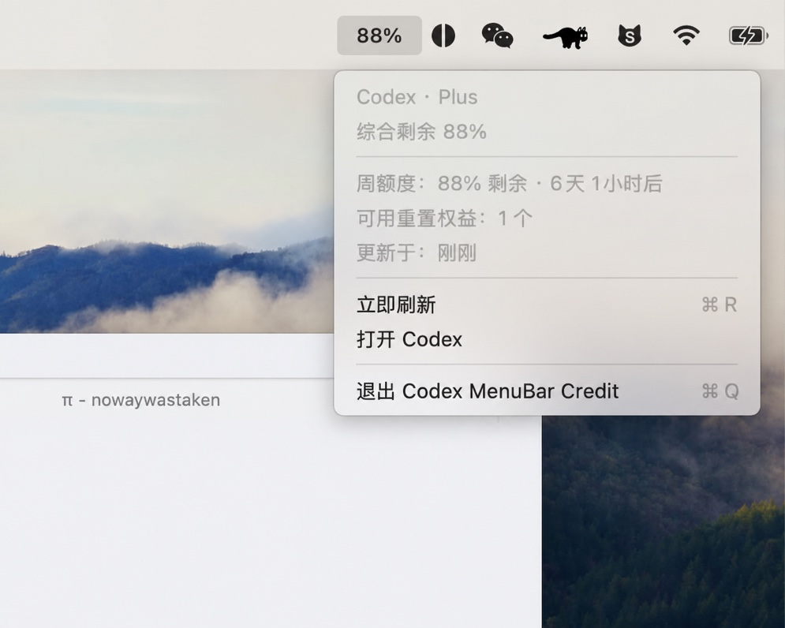

# Codex Credit Bar

Codex Credit Bar 是一个原生 macOS 菜单栏应用，用于查看 Codex CLI 账户的实时额度，并在需要时打开本机已安装的 ChatGPT App。

## 应用效果



## 功能

- 在菜单栏优先显示 5 小时额度；账号没有此限制时显示周额度。
- 查看主额度、次级额度、重置时间、套餐和额外额度信息。
- 启动时、每 10 秒以及打开菜单时自动刷新。
- 刷新失败时保留最近一次成功数据，并显示错误提示。
- 通过 `codex app-server` 读取 Codex CLI 的登录状态；应用不会复制或保存访问令牌。
- 自动将 macOS 系统代理（包括 PAC）传递给 Codex CLI，支持从 Finder 启动。
- 从菜单直接启动本机的 ChatGPT App（当前 Bundle ID：`com.openai.codex`，兼容旧版 `com.openai.chat`）。
- 唤出菜单及每小时自动检查 GitHub `autobuild` Release，有新版本时提示并下载、安装和重启。

## 系统要求

- macOS 13 或更高版本
- 已安装并完成登录的 [Codex CLI](https://github.com/openai/codex)
- 可选：已安装 ChatGPT macOS App，以使用“打开 ChatGPT”菜单项

首次使用前，请在终端完成登录：

```sh
codex login
```

## 安装与运行

### 从源码运行

```sh
swift run
```

如果 Codex CLI 不在常见安装路径中，可以通过环境变量指定路径：

```sh
CODEX_BIN=/path/to/codex swift run
```

### 构建 macOS App

```sh
./scripts/build-app.sh
open "dist/Codex Credit Bar.app"
```

构建脚本会生成经过 ad-hoc 签名的 `dist/Codex Credit Bar.app`。`dist/` 是构建产物，不应提交到仓库。

## 自动构建发布

每次向 GitHub 推送提交后，GitHub Actions 会在 macOS runner 上自动执行构建和测试，生成 `Codex Credit Bar.app`，并更新一个名为 **autobuild** 的正式 Release。

Release 使用固定的 `autobuild` 标签和标题，Assets 中显示为 `Codex Credit Bar.app`。每次提交都会删除并重新创建该 Release，将标签指向最新提交并刷新发布时间，不会保留旧 Release 或附件，不需要手动创建 Release 或上传文件。GitHub 禁止 Release 附件使用 `.app` 目录扩展名，因此底层文件名为 `Codex.Credit.Bar.app.tar`，但显示标签仍为 `Codex Credit Bar.app`；这是未压缩的 tar 数据，下载后的更新流程会自动处理。

工作流定义位于 `.github/workflows/release.yml`。

## 使用说明

应用启动后会显示在 macOS 菜单栏。点击菜单栏中的额度数字即可查看详情：

- **打开 ChatGPT**：启动本机已安装的 ChatGPT App；未安装或启动失败时显示提示，不会打开网页。
- **更新状态**：唤出菜单时及每小时自动检查一次，显示“正在检查...” “已是最新版本”或“有最新版本 - 前六位哈希”。点击该项可以立即重新检查。
- **退出 Codex Credit Bar**：退出应用。

应用通过 Codex CLI 的本地 `app-server` 获取数据。若额度读取失败，请确认：

1. 已成功执行 `codex login`，且当前用户与运行 App 的用户一致。
2. Codex CLI 可执行文件位于 `PATH`、`CODEX_BIN` 或常见安装路径（包括 Homebrew、npm、Volta 和 asdf 路径）。
3. `codex app-server --stdio` 可以正常启动；终端中可用该命令进行诊断。
4. 若 macOS 使用系统代理或 PAC，确保代理程序正在运行；App 会解析系统设置并传递给 Codex CLI。

更新功能需要联网访问 GitHub；网络失败、没有可用附件或没有权限替换安装目录时，应用会显示具体错误。更新只接受仓库发布的 `Codex Credit Bar.app`（底层为 `.tar`）附件，不会打开网页安装。

## 开发与验证

项目使用 Swift Package Manager，不依赖第三方库：

```sh
swift build
swift test
```

也可以使用 Make：

```sh
make build
make test
make app
make clean
```

源码位于 `Sources/`，测试位于 `Tests/`。

## 贡献

欢迎提交修复和改进。提交 Pull Request 前请：

1. 保持改动聚焦，并说明变更原因。
2. 为非平凡逻辑补充或更新测试。
3. 运行 `swift build` 和 `swift test`。
4. 不要提交 `.build/`、`dist/`、`.swiftpm/` 或 `.DS_Store`。

详细说明见 [CONTRIBUTING.md](CONTRIBUTING.md)。

## 问题反馈

提交 Issue 时请包含：

- macOS 版本和 Mac 芯片架构。
- Codex CLI 版本及安装方式。
- 复现步骤、实际结果和预期结果。
- 相关终端输出或应用错误提示；请移除令牌、账号信息等敏感内容。

## 许可证

本项目基于 [MIT License](LICENSE) 发布。
