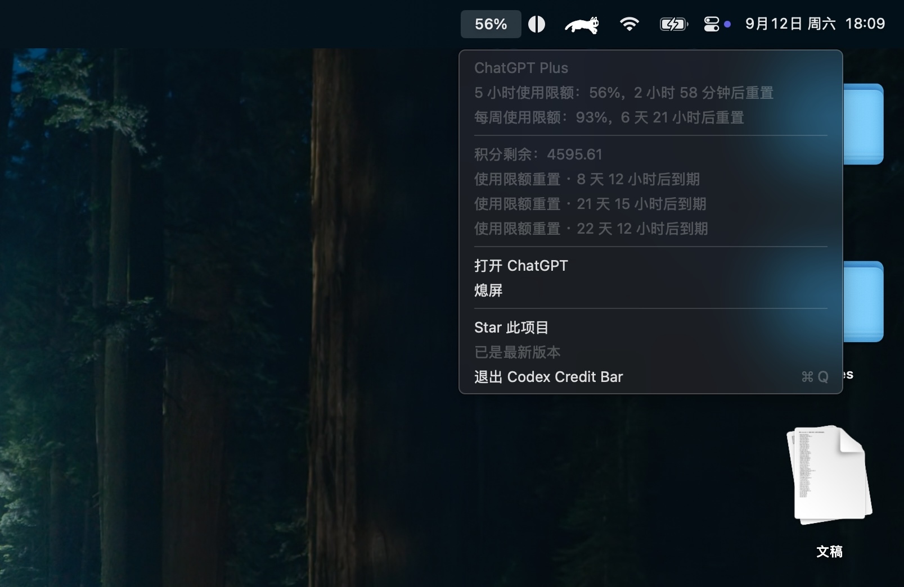

# Codex Credit Bar

Codex Credit Bar 是一个原生 macOS 菜单栏 App，用于查看本机 Codex CLI 账户额度，并提供打开 ChatGPT、熄屏和更新 App 等快捷操作。

## 功能

- 优先显示 5 小时额度；账号没有该窗口时显示周额度。
- 显示套餐、主/次级限额、重置时间、Credits 和限额重置权益。
- 支持简体中文和 English，跟随 macOS 首选语言。
- 启动时、每 15 秒和打开菜单时刷新账户；菜单内倒计时每秒更新。
- 刷新失败时保留最近一次成功数据，并显示错误提示。
- 通过本机 codex app-server 读取状态，不复制或保存 Codex 访问令牌。
- 自动向 Codex CLI 传递 macOS 系统代理和 PAC 设置，支持 Finder 启动。
- 从菜单打开本机 ChatGPT App、打开项目 GitHub 页面或执行 pmset displaysleepnow。
- 每 3 分钟检查 GitHub autobuild Release；可用更新会显示最新提交的前 7 位哈希，并可从菜单下载、校验、安装和重启。

## 系统要求

- macOS 13+；
- 已安装并完成登录的 [Codex CLI](https://github.com/openai/codex)；
- 可选：已安装 ChatGPT macOS App，以使用“打开 ChatGPT”。

首次使用前：

~~~sh
codex login
~~~

## 安装与运行

直接运行 Swift Package：

~~~sh
swift run
~~~

如果 codex 不在常见路径中：

~~~sh
CODEX_BIN=/path/to/codex swift run
~~~

构建可双击启动的 App：

~~~sh
./scripts/build-app.sh
open "dist/Codex Credit Bar.app"
~~~

构建脚本会生成经过 ad-hoc 签名的 dist/Codex Credit Bar.app。dist/、.build/ 和 .swiftpm/ 都是本地构建产物。

## 开发与验证

~~~sh
swift build
swift test
~~~

也可以使用：

~~~sh
make build
make test
make app
~~~

实现位于 [Sources/CodexMenuBarCredit](Sources/CodexMenuBarCredit)，测试位于 [Tests/CodexMenuBarCreditTests](Tests/CodexMenuBarCreditTests)。GitHub Actions 使用 [release.yml](.github/workflows/release.yml) 在 macOS runner 上构建测试并发布 Autobuild。

## 获取帮助与贡献

额度读取失败时，请确认 codex login 已成功、App 与 CLI 使用同一 macOS 用户、codex app-server 可启动，并检查 CODEX_BIN、PATH 或系统代理配置。

提交 Issue 请附上 macOS 版本、芯片架构、Codex CLI 版本、安装方式、复现步骤和错误信息；请移除 token、账号和日志中的敏感内容。欢迎提交聚焦的 Pull Request，非平凡逻辑应同步测试。

维护者：[notCorwin](https://github.com/notCorwin)。贡献细则见 [CONTRIBUTING.md](CONTRIBUTING.md)，许可证见 [LICENSE](LICENSE)。
